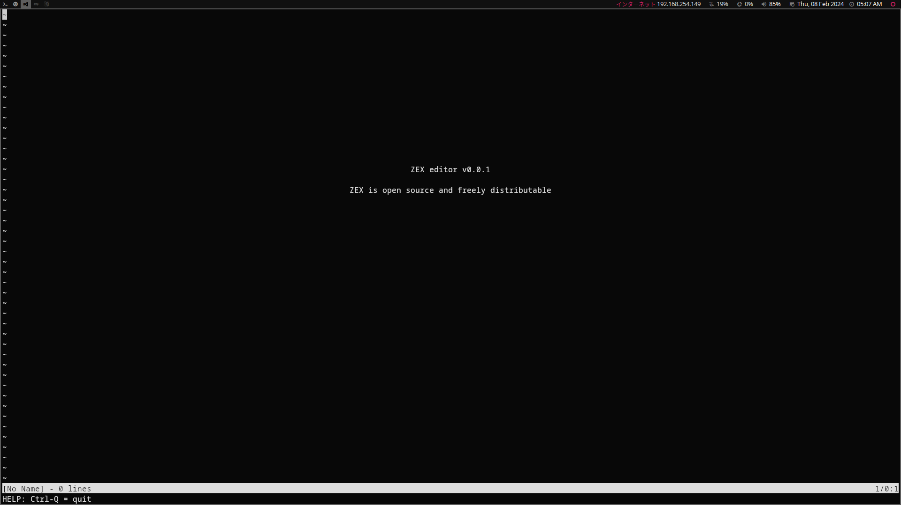

# Zex: A Minimalistic Vim-Like Text Editor in C

Zex is a simple text editor inspired by Vim, implemented in the C programming language.

<p align="center">
    
</p>

## Description

Zex is a simple text editor that focuses on minimalism and simplicity. Zex provides basic text editing functionalities reminiscent of Vim while maintaining a lightweight footprint.

### Features

- Vim-Like Experience: Zex offers a familiar editing experience for users accustomed to Vim's keybindings and commands.
- Minimalistic Design: Built with simplicity in mind, Zex aims to provide essential text editing features without unnecessary complexity.
- Lightweight: With no external libraries or dependencies, Zex boasts a lightweight codebase, making it easy to understand, modify, and extend.
- Customizable and Forkable: Developers can easily customize Zex to suit their needs or fork the project to build upon its foundation, thanks to its clean and straightforward codebase.

### Built with

- Pure C

## Getting started

### Usage

Zex can be compiled and run on various platforms supporting C development. Simply clone the repository, compile the source code, and start editing text with Zex.

1. Clone the project <br>
   `git clone https://github.com/re-nanashi/zex.git`

2. Go the directory and run make

```
cd zex
make
```

3. Start editing

```
./zex {filename}
```

### Contributing

Contributions to Zex are welcome! Whether it's bug fixes, new features, or improvements to existing functionalities, feel free to fork the repository, make your changes, and submit a pull request.

### License

Zex is licensed under the MIT License, allowing for both personal and commercial use with attribution.
